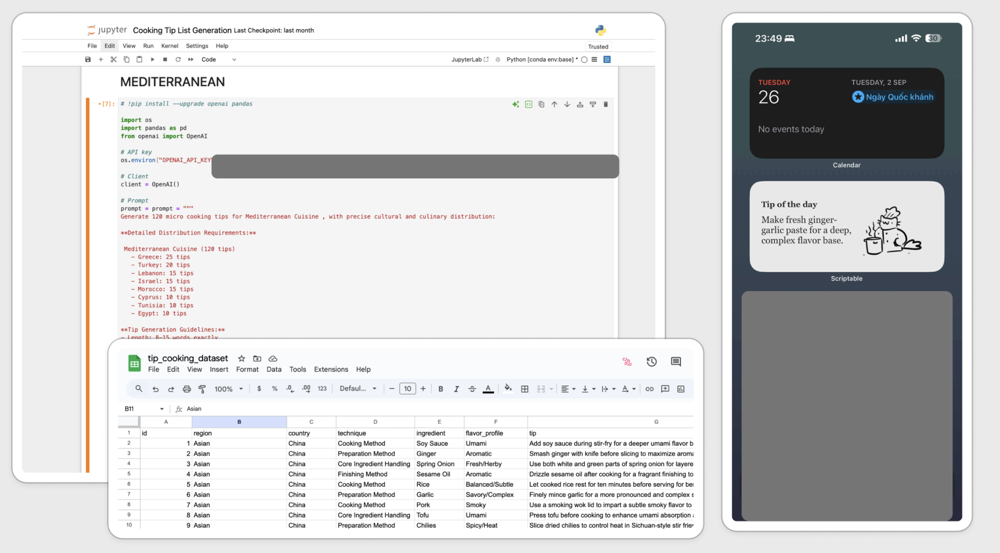

## Problem Statement
My mom and I struggled with daily cooking inspiration, often falling into repetitive meal patterns or spending too much mental energy deciding what to cook. We needed a simple way to get fresh cooking ideas without the cognitive overhead of planning or researching recipes.

## Solution
A weather-aware cooking tips widget built on Scriptable that delivers contextual culinary inspiration filtered by local weather conditions and regional cuisine preferences. I chose Scriptable over Apple's paid developer program since it's free and perfectly suited for personal widget development need.

## Features

- **Weather Integration**: Matches cooking suggestions to current weather (spicy foods for rainy days, grilled options for sunny weather)
- **Regional Filtering**: Focuses on preferred cuisine types (Asian, European, Mediterranean)
- **Daily Automation**: Refreshes once per day at 8AM with smart caching to minimize API usage
- **Offline Support**: Uses cached data when network is unavailable
- **Visual Variety**: Random cooking icons keep the widget visually engaging

## Tech Stack

- **Frontend**: Scriptable iOS widget framework
- **Backend**: Google Apps Script 
- **Database**: Google Sheets
- **Weather Data**: OpenWeatherMap API
- **Storage**: Local file caching with JSON format

## Implementation

1. **Data Layer**: Used Jupyter Notebooks to call Claude API in batches for generating cooking tips across different regions and flavor profiles, then merged and exported to CSV file which was brought to Sheets for cooking tip database
2. **API Layer**: Built Google Apps Script endpoint that maps weather conditions to appropriate flavor categories and filters by region
3. **Widget Layer**: Developed Scriptable widget that fetches location, calls weather API, queries cooking database, selects randon image and caches results locally
4. **Automation**: Configured daily refresh logic that only fetches new data after 8AM, using cache for all other interactions

## Results
The widget became part of my daily routine - I check it every morning. 4 friends adopted it after seeing it work, each customizing their regional preferences
